## Starting the Controller
> NOTE: For detailed instructions on building the controller, see the 
[readme](https://github.com/bu-vip/multikinect/blob/master/README.md)

To run the controller:
> NOTE: Make sure your data directory path is an absolute path (e.g. "/home/user/Desktop/multikinect_data")
```bash
bazel run //src/main/java/edu/bu/vip/multikinect/controller:main -- --data_dir <directory-path>
```

To access the web console, go to [http://localhost:8080](http://localhost:8080) in your web browser.

You can also access the web console from other machines if you are on the same network, 
have the proper firewall rules, etc. configured.

## Connecting the Cameras
Once you've started the Camera program, enter the IP of the controller and configure the camera id.

> NOTE: Due to issue [#4](./issues/4), you must have a camera with id "camera1". 
The system is known to work with ids "camera1" and "camera2".

Then hit "Connect."


## Using the Controller
Before you can begin recording data, you first need to calibrate the system. 
To create a calibration, click the "New Session" button. Then click "Add Calibration":
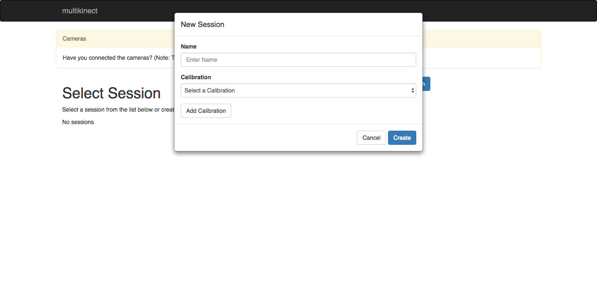

Enter a name for the calibration and click "Create":
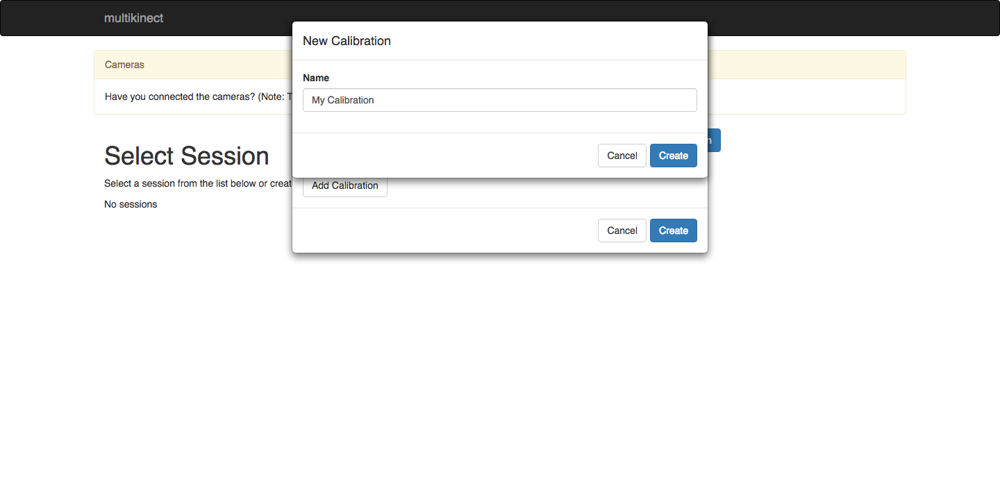

The controller needs data to calculate the calibration. 
To record data, click the "New Recording" button.
> NOTE: For calibration to work properly, only 1 person can be in view of the cameras at once

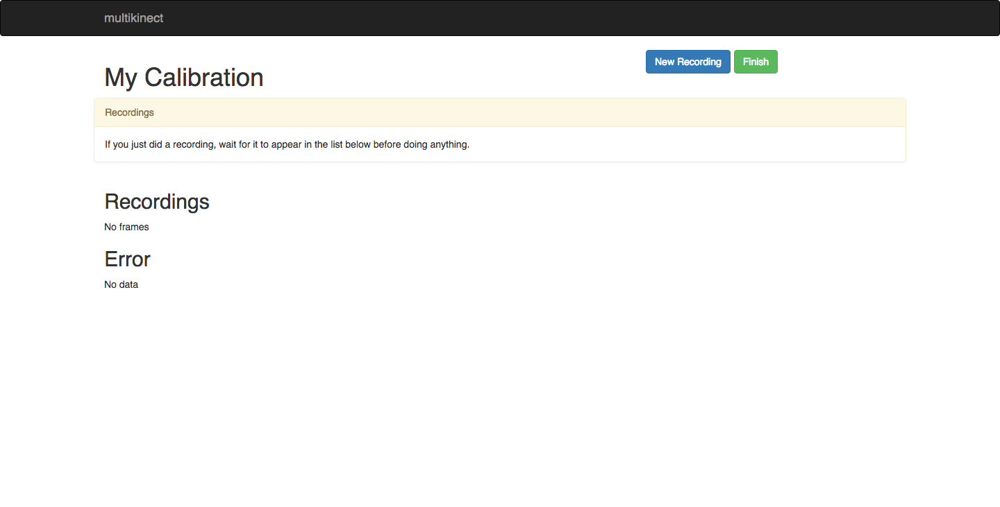

Once you start recording, make sure you are in view of both cameras. 
When you're finished, click "Stop Recording":
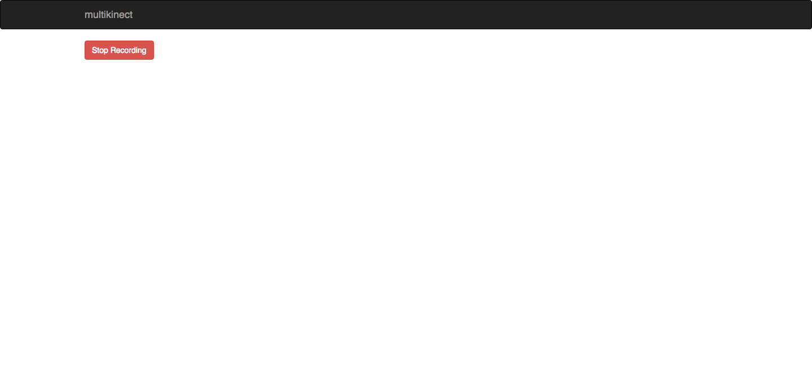

Wait for the data to be processed. When processing is complete, an error graph should appear. 
To finish creating the calibration, click "Finish":
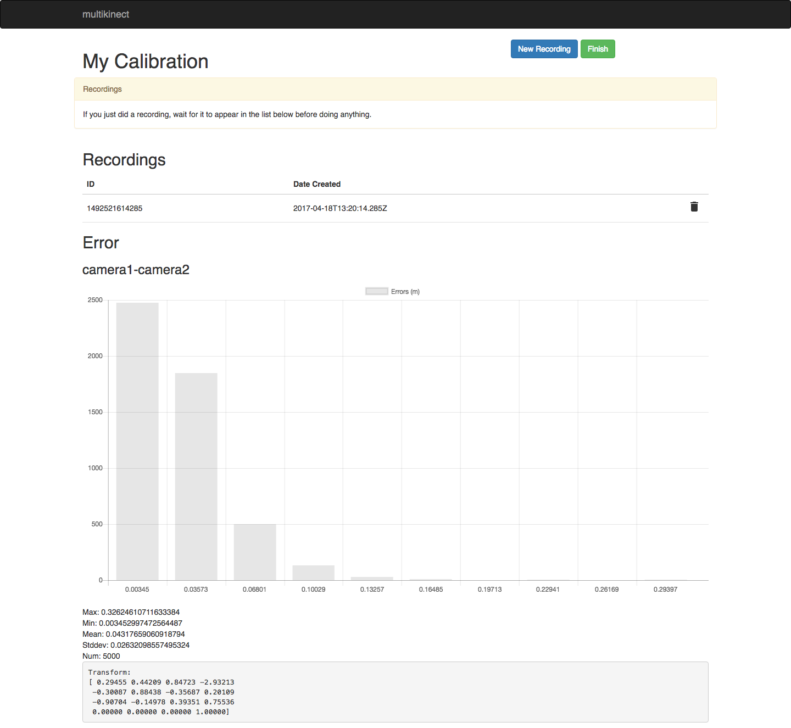

Now to finish creating your session, input a name and select the correct calibration from the list. 
Multiple sessions can share the same calibration:
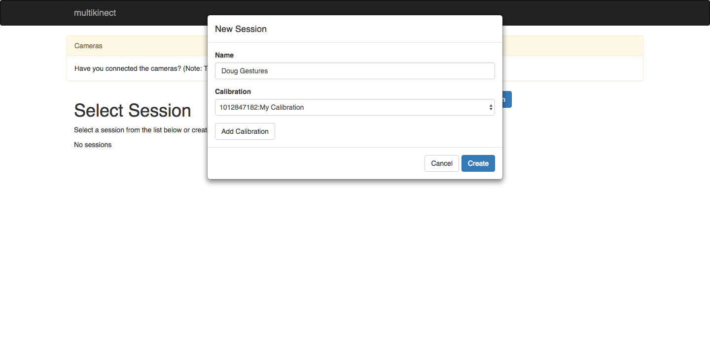

The new session should appear in the table. Select it:
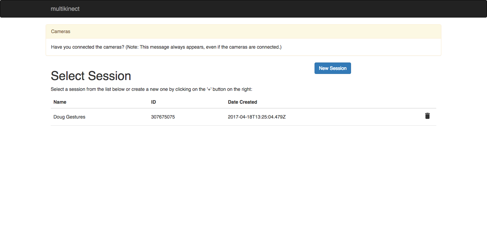

You should now see a view of what the cameras are detecting. 
To start recording data, click "New Recording":
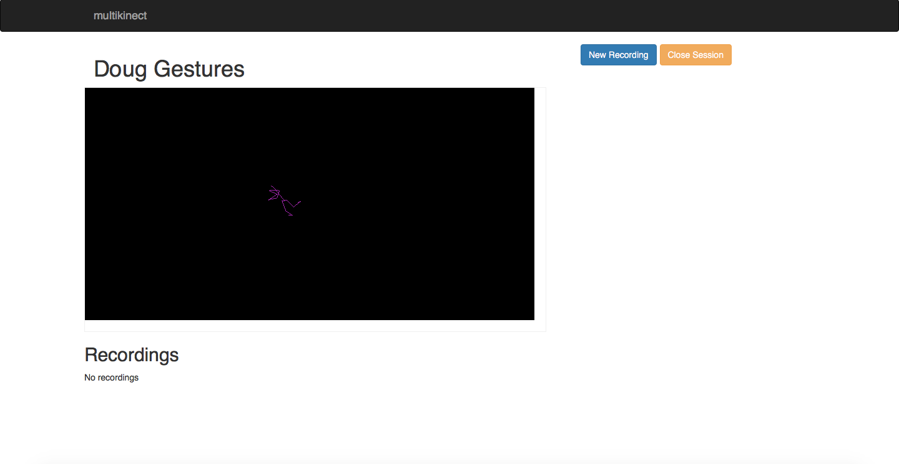

Give the recording a name. Once you hit "Create", the system will begin recording.
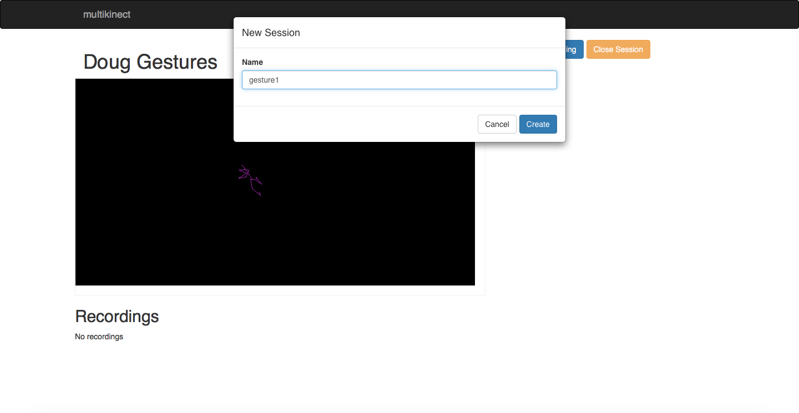

You can view the length of the recording in the table below the camera preview. 
To stop recording, hit "Stop Recording":
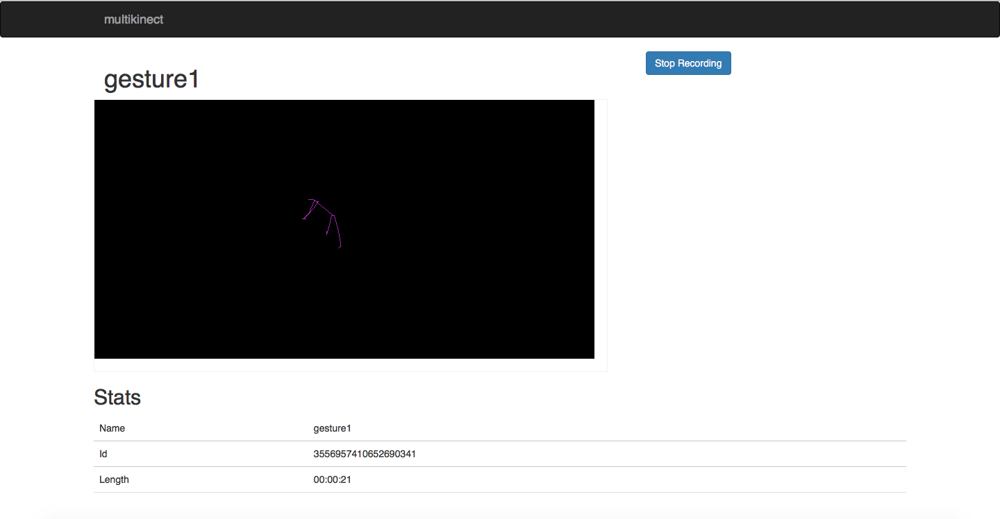

Your new recording should appear in the recordings list:
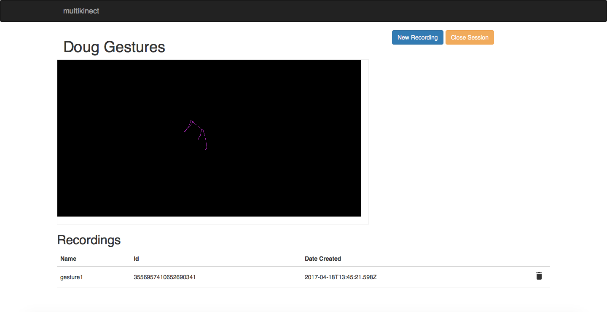
